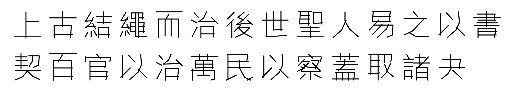
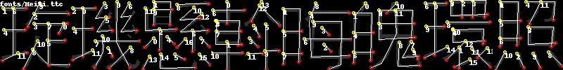
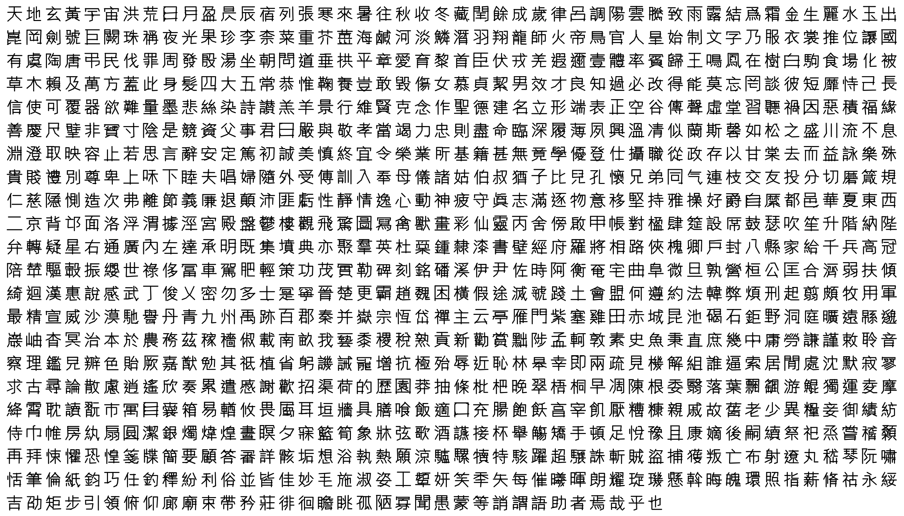

# chinese-hershey-font
*Convert Chinese Characters to Single-Line Fonts using Computer Vision*

- **Check out the [Live demo](https://lingdong-.github.io/chinese-hershey-font/)!**
- **Download the hershey font: [Heiti.hf.txt](dist/hershey/Heiti.hf.txt) (20975 unicode characters), [Mingti.hf.txt](dist/hershey/Mingti.hf.txt) (73874 unicode characters)**


Single-line fonts such as [the Hershey fonts](https://en.wikipedia.org/wiki/Hershey_fonts) are massively useful for making cool procedural graphics and for engraving. They're also arguably easier to learn for neural nets.

This tool automatically generates Chinese Single-Line fonts given a regular True Type Font file (ttf/ttc). It can output either the classic Hershey format, or a JSON file containing all the polylines.

The algorithm scans a raster rendering of a character at many different angles to find line segments that are most likely part of a stroke. It then estimates the strokes by connecting, merging, and cleaning up the line segments.



## Dependencies

- Python 2
- PIL/Pillow (`pip install pillow`)


## File Formats

The following are types of files this software can produce to encode single-line fonts.

### Stroke Files

A JSON file with one object. The keys of the object are unicode indices of characters. Each key maps to an array of polylines. A polyline is an array of points. A point is a 2-element Array containing x and y coordinates. A coordinate is a float between 0.0 and 1.0, and (0,0) is the upper left-corner. For example:

```json
{
  "U+4E00":[[[0.0, 0.55], [1.0, 0.55]]],
  "U+4E01":[[[0.02, 0.02], [0.99, 0.02]], [[0.51, 0.02], [0.53, 0.925], [0.31, 1.0]]]
}
```
The above encoding contains the first two Chinese characters in unicode, "一" and "丁".

### Hershey Fonts

> The Hershey fonts are a collection of vector fonts developed c. 1967 by Dr. Allen Vincent Hershey at the Naval Weapons Laboratory, originally designed to be rendered using vectors on early cathode ray tube displays. The fonts are publicly available and have few usage restrictions. Vector fonts are easily scaled and rotated in two or three dimensions; consequently the Hershey fonts have been widely used in computer graphics, computer-aided design programs, and more recently also in computer-aided manufacturing applications like laser engraving. ([Wikipedia](https://en.wikipedia.org/wiki/Hershey_fonts))

[This link](http://paulbourke.net/dataformats/hershey/) gives an overview on how to parse Hershey fonts. You can also find my own implementation at [Lingdong-/p5-hershey-js](https://github.com/LingDong-/p5-hershey-js).

Compared to stroke files, Hershey Fonts are many times more compact, but also has less accurate coordinates.


## Usage

### Pre-compiled Fonts

If you're only interested in utilizing pre-generated single-line fonts, you can grab them at the following places:

- Hershey fonts can be found in [dist/hershey](dist/hershey) folder.
  - [Heiti.hf.txt](dist/hershey/Heiti.hf.txt): **20975** characters, based on [思源黑體(Souce Han Sans)](https://github.com/adobe-fonts/source-han-sans). This includes all unicode basic CJK Ideographs.
  - [Kaiti.hf.txt](dist/hershey/Kaiti.hf.txt): **20975** characters, based on [全字庫正楷體(TW-Kai)](https://data.gov.tw/dataset/5961).
  - [Mingti.hf.txt](dist/hershey/Mingti.hf.txt): **73874** characters, based on [花園明朝體(Hanazono)](https://zh.wikipedia.org/wiki/花園字體). This includes all unicode basic CJK Ideographs, as well as CJK Ideographs Extension A - E.
  - [Heiti-small.hf.txt](dist/hershey/Heiti-small.hf.txt). **20975** characters, similar to Heiti.hf.txt, but has smaller font size and spacing.
  - [Mingti-basic.hf.txt](dist/hershey/Mingti-basic.hf.txt) **27631** characters, a subset of Mingti.tf.txt, containing the basic CJK Ideographs and Extension A.
- Stroke files (JSON containing polyline coordinates) can be found in [dist/json](dist/json) folder.

**Note:**

`Heiti.hf.txt` and `Kaiti.hf.txt` were originally based on proprietary macOS system fonts `STHeiti` and `STKaiti`. They're now replaced with open source alternatives.


### Generating Stroke Files

If you would like to generate new single-line fonts from custom TTF/TTC files, first use the following command to generate a JSON-encoded stroke file.

```
python char2stroke.py build path/to/font.ttf
```
Optional arguments:

```
  --first [FIRST]
  --height [HEIGHT]
  --last [LAST]
  --ngradient [NGRADIENT]
  --output [OUTPUT]
  --strw [STRW]
  --width [WIDTH]
```
- `width` and `height` determines the dimension of the raster images of characters to be scanned. The larger these numbers, the more detailed and the slower. Default is `100` for both.
- `strw` is the approximate stroke width (in pixels, at given `width` and `height`). This is used when merging strokes. Default is `10`.
- `first` and `last` specifies the range of unicode characters to include. Default values are `0x4e00` and `0x9fef`, which contains all the "CJK Ideograph" glyphs.
- `ngradient` is the number of different gradients used to scan the image. At `ngradient = 1`, only strokes at 0°, 45° and 90° are scanned, while at `2`, `3` and `4`, slopes of `atan(1/2)`, `atan(1/3)` and `atan(1/4)` are also included. Default is `2`.
- `output`: path to write the output file. When this is not specified, the program writes to `stdout`, and `>`([info](https://en.wikipedia.org/wiki/Redirection_(computing))) and `|`([info](https://en.wikipedia.org/wiki/Pipeline_(Unix))) can be used to redirect the output.


### Quick Tests

Before generating large files, it is helpful to do some quick tests on small sets of characters, compare how different fonts turn out, and tweak parameters. The following command facilitate this process with side-by-side visualization of computer vision results.

```
python char2stroke.py test path/to/font1.ttf path/to/font2.ttf ...
```
Optional arguments:

```
  --corpus [CORPUS]
  --height [HEIGHT]
  --ngradient [NGRADIENT]
  --nsample [NSAMPLE]
  --strw [STRW]
  --width [WIDTH]
```
- `corpus`: string to test on. Default is the text of [Thousand Character Classic](https://en.wikipedia.org/wiki/Thousand_Character_Classic).
- `nsample`: number of characters to be randomly picked from the corpus. Default is `8`. 
- The other arguments are identical to those of `build` mode.


### Generate Hershey Font from Stroke File

The following command generates a Hershey font from a stroke file produced in the previous step.

```
python tohershey.py path/to/input.json > path/to/output.hf.txt
```

## Example


